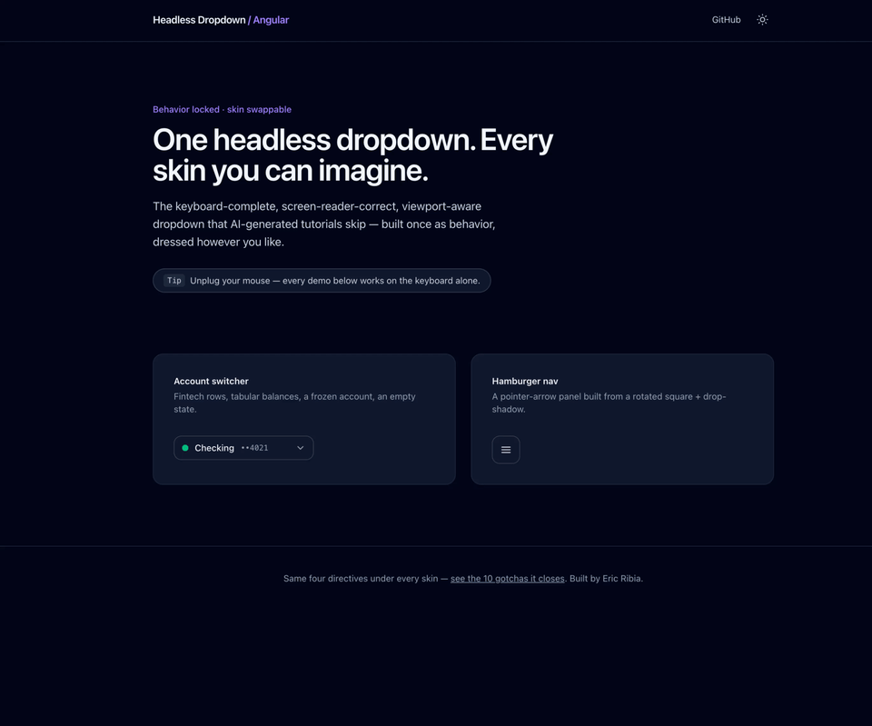

# Angular Headless Dropdown

> A production-grade, fully accessible dropdown for Angular — **headless behavior** you can skin any way you want. The ten things AI quietly skips, all closed.

<!-- Replace these with real badges once CI + deploy are set up -->
[](https://ericribia.github.io/angular-headless-dropdown)
[](https://github.com/EricRibia/angular-headless-dropdown/actions/workflows/ci.yml)
[](./LICENSE)
[](https://angular.dev)

A dropdown is a button and a list. The naive version is trivial; the version you can actually **ship** — keyboard-complete, screen-reader-correct, viewport-aware — is not. This repo is that second version, built as headless primitives: the behavior is locked and reusable, the presentation is entirely yours.

**Unplug your mouse and try the [live demo](https://ericribia.github.io/angular-headless-dropdown). Everything still works.**



---

## Why this exists

Ask any AI to "build a dropdown" and you'll have a working one in seconds — and it'll be quietly broken in about ten ways: focus that strands keyboard users, no `Escape`, a click-to-close that bounces back open, missing ARIA, a menu that clips off the bottom of the screen. Those gaps are exactly where real software lives, and closing them is the part a prompt doesn't hand you.

This is the worked example, with every gap closed in exactly one place — so you can read *how*, not just *that*.

## Behavior vs. skin

```
                    ┌─────────────────────────┐
                    │   DropdownStore (brain) │   pure state · no DOM
                    │  open · activeIndex · …  │
                    └─────────────┬───────────┘
            ┌─────────────────────┼─────────────────────┐
            │                     │                     │
   ┌────────┴───────┐   ┌─────────┴────────┐   ┌────────┴───────┐
   │ Trigger        │   │ Panel            │   │ Item           │
   │ (the door)     │   │ (the ears)       │   │ (the option)   │
   └────────┬───────┘   └─────────┬────────┘   └────────┬───────┘
            └─────────────────────┼─────────────────────┘
                                  │  state via [data-active] / [aria-disabled]
                          ┌───────┴────────┐
                          │   Your skin    │   CSS only · zero behavior
                          └────────────────┘
```

The brain holds pure state and never touches the DOM. Each directive owns one surface and translates events into brain commands. CDK handles only the genuinely hard geometry (collision-aware positioning, scroll following). Your skin reacts to state through `[data-active]` and `[aria-disabled]` and sets **no behavior of its own** — which is why a new look is a new stylesheet, not a new component.

## The 10 gotchas it closes

| #  | What AI usually skips                          | Resolved in            |
|----|------------------------------------------------|------------------------|
| 1  | Focus returns to the trigger on close          | Trigger + Store        |
| 2  | `Escape` closes and restores focus             | Panel                  |
| 3  | Click-outside dismiss **without** reopen-bounce | Trigger + Store guard  |
| 4  | Arrow-key navigation with wrap-around          | Store + Panel          |
| 5  | Type-to-jump (typeahead)                        | Store + Panel          |
| 6  | Full ARIA contract (`expanded`, roles, `activedescendant`) | Trigger + Panel + Item |
| 7  | Viewport-aware flip (opens up near the bottom)  | Trigger (CDK)          |
| 8  | Stays glued to the trigger on scroll/resize     | Trigger (CDK)          |
| 9  | Disabled rows skipped + empty state             | Store + Item + Panel   |
| 10 | One selection path for mouse **and** keyboard   | Item + Panel           |

Full breakdown with the reasoning behind each: [`docs/10-gotchas.md`](docs/10-gotchas.md).

## Quick start

```bash
git clone https://github.com/ericribia/angular-headless-dropdown.git
cd angular-headless-dropdown
npm install
npm start          # http://localhost:4200
```

> `src/styles.css` imports `@angular/cdk/overlay-prebuilt.css`. Leave it in — without it the overlay renders unpositioned in the top-left corner.

## Usage (headless)

The four primitives, no styling. Bring your own markup and CSS.

```html
<button appDropdownTrigger #t="appDropdownTrigger"
        [align]="'start'" [offset]="8"
        cdkOverlayOrigin #origin="cdkOverlayOrigin" type="button">
  Options
</button>

<ng-template
  cdkConnectedOverlay
  [cdkConnectedOverlayOrigin]="origin"
  [cdkConnectedOverlayOpen]="t.store.isOpen()"
  [cdkConnectedOverlayPositions]="t.positions()"
  [cdkConnectedOverlayScrollStrategy]="t.scrollStrategy"
  (overlayOutsideClick)="t.onOutsideClick($event)">
  <ul [appDropdownPanel]="t.store">
    @if (t.store.isEmpty()) { <li role="presentation">No options</li> }
    <li [appDropdownItem]="t.store" (selected)="profile()">Profile</li>
    <li [appDropdownItem]="t.store" [itemDisabled]="true">Billing (soon)</li>
    <li [appDropdownItem]="t.store" (selected)="logout()">Log out</li>
  </ul>
</ng-template>
```

## Skins included

| Skin | What it shows |
|------|----------------|
| **Account switcher** (fintech) | Rich rows, tabular balances, a frozen/disabled account, an empty state, a footer action |
| **Hamburger menu** | The CSS arrow tail (rotated-square + `drop-shadow`), centered alignment |

Both consume the **same** four primitives. Switching skins changes only CSS — that's the entire thesis, made tangible.

## API

**`appDropdownTrigger`** (`exportAs: appDropdownTrigger`)

| Input    | Type                           | Default   | Purpose                                  |
|----------|--------------------------------|-----------|------------------------------------------|
| `align`  | `'start' \| 'center' \| 'end'` | `'start'` | Which panel edge lines up with the button (RTL-aware) |
| `offset` | `number`                       | `4`       | Gap in px between trigger and panel       |

Exposes `store`, `positions()`, `scrollStrategy`, and `onOutsideClick()` for the overlay wiring.

**`appDropdownPanel`** — bind the store: `[appDropdownPanel]="t.store"`.

**`appDropdownItem`**

| Binding            | Type        | Purpose                                     |
|--------------------|-------------|---------------------------------------------|
| `[appDropdownItem]`| `DropdownStore` | The shared store (required)              |
| `itemLabel`        | `string`    | Typeahead text (falls back to visible text) |
| `itemDisabled`     | `boolean`   | Skipped by keyboard, dimmable via `aria-disabled` |
| `(selected)`       | `void`      | Fires on choose (click **or** keyboard)     |

## Accessibility & keyboard

| Key                         | Action                                   |
|-----------------------------|------------------------------------------|
| `Tab`                       | Focus the trigger                         |
| `Enter` / `Space` (trigger) | Toggle open                               |
| `↓` / `↑` (trigger)         | Open and highlight first / last           |
| `↓` / `↑` (menu)            | Move highlight (wraps, skips disabled)    |
| `Home` / `End`              | Jump to first / last                      |
| `A`–`Z`                     | Typeahead jump                            |
| `Enter` / `Space` (menu)    | Select the highlighted item               |
| `Escape`                    | Close and return focus to the trigger     |

Follows the WAI-ARIA menu-button pattern: focus stays on the panel, the active item is surfaced virtually via `aria-activedescendant`.

## Testing

- `DropdownStore` is pure logic with no DOM — see `*.spec.ts` for unit tests on wrap-around, disabled-skipping, and typeahead. (That it's *this* easy to test is the argument for headless.)
- Manual keyboard / screen-reader pass: [`docs/keyboard-test.md`](docs/keyboard-test.md).

## Built with

Modern Angular (v20+): standalone components, signals, the new control flow, and Angular CDK Overlay for positioning. Tailwind is used in the **demo skins only** — the primitives ship no styles.

[//]: # (## The series)

[//]: # ()
[//]: # (This component is broken down piece by piece in a written series on production-grade UI the AI-generated version skips:)

[//]: # ()
[//]: # (- The 10 things AI forgets when it builds a dropdown — *[link]*)

[//]: # (- Don't reinvent dropdown positioning — let CDK flip it — *[link]*)

[//]: # (- Headless Angular: separate the brain from the skin — *[link]*)


## About


I'm **Eric Ribia**, a frontend engineer (7+ years) focused on the line where good code meets good design. I build the production layer most tutorials — and most prompts — leave out.


- Articles: [Medium](https://medium.com/@ericribia/the-10-things-ai-forgets-when-it-builds-a-dropdown-dbc99140758a?source=friends_link&sk=523ef0b204bd4e52b7e7d3dbcb6a17f1)

- Reach me: [ericribia@gmail.com](mailto:ericribia@gmail.com)

## License

MIT © Eric Ribia
